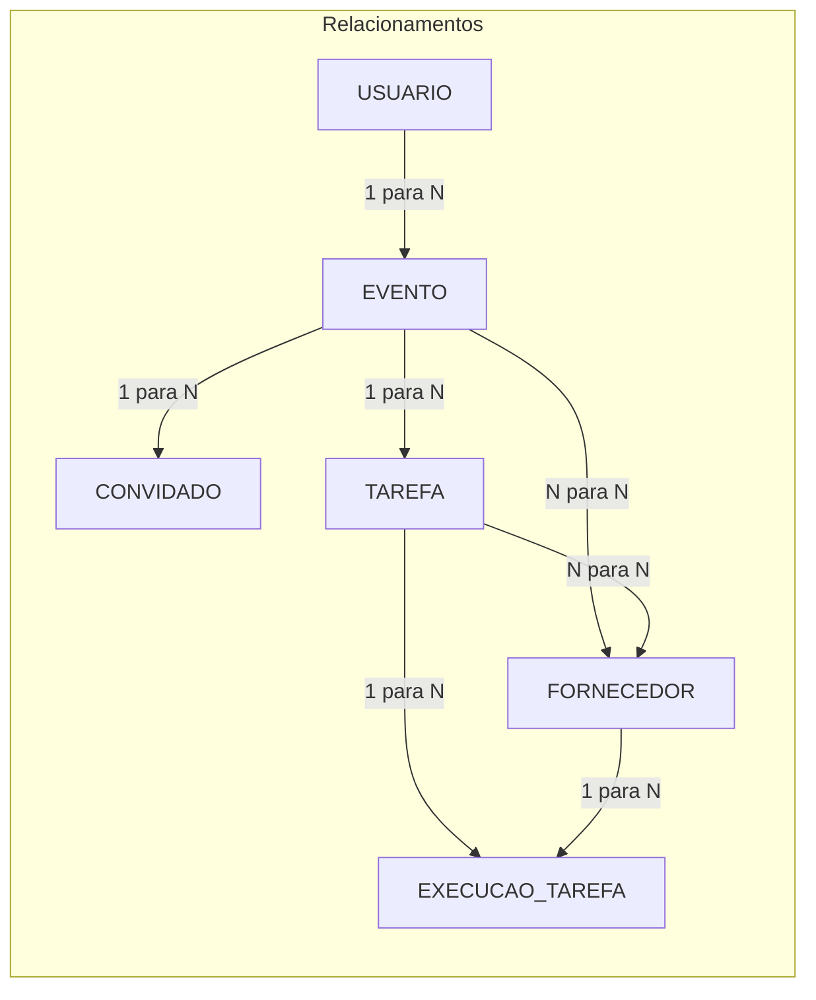

# Modelo Entidade-Relacionamento (MER)

**Sistema de Gestão de Eventos** — Projeto Aplicado II  
**Equipe 10** · Centro Universitário SENAI Santa Catarina  

**Versão:** 1.0 · **Data:** abril de 2026  

---

## 1. Objetivo deste documento

Descrever o **modelo conceitual** de dados (entidades, atributos, classificação forte/fraca e relacionamentos com cardinalidade) alinhado à [Documentação do Sistema de Gestão de Eventos.md](./Documentação%20do%20Sistema%20de%20Gestão%20de%20Eventos.md) e ao diagrama ER da solução, **excluindo** as entidades **PAGAMENTO**, **AVALIAÇÃO**, **NOTIFICAÇÃO** e **CONTRATO**.

---

## 2. Fontes

| Fonte | Uso no modelo |
|--------|----------------|
| Documentação do sistema (RF e atores) | Atributos e regras de negócio (RF01, RF03, RF05, RF08, RF09, RF10; seção 4) |
| Diagrama ER (anexo) | Relacionamentos e cardinalidades entre USUARIO, EVENTO, CONVIDADO, TAREFA, FORNECEDOR e EXECUCAO_TAREFA |

**Nota:** Na documentação oficial, a seção **6. Diagrama de Modelo Entidade e Relacionamento** ainda está como placeholder; a lista de atributos por entidade **foi derivada** dos requisitos funcionais e do diagrama, com pontos de validação indicados onde o texto não fecha o desenho (por exemplo, **EXECUCAO_TAREFA** e o **N:N** entre TAREFA e FORNECEDOR).

---

## 3. Convenções: entidade forte vs fraca

- **Entidade forte:** possui existência e identificação próprias no domínio; não depende de outra entidade para existir como conceito de negócio (ex.: **USUARIO**, **FORNECEDOR**).
- **Entidade fraca / dependente:** no modelo conceitual, a existência mínima ou o significado completo depende de outra entidade (**CONVIDADO** e **TAREFA** em relação a **EVENTO**; **EXECUCAO_TAREFA** em relação a **TAREFA** e **FORNECEDOR**). Na implementação relacional é comum usar chave substituta (surrogate) e chaves estrangeiras.

---

## 4. Entidades, atributos e classificação

### 4.1 USUARIO — **entidade forte**

| Atributo | Descrição / origem |
|----------|-------------------|
| `id_usuario` | Identificador único (PK). Implícito no modelo. |
| `nome` | Cadastro de usuário. |
| `email` | Cadastro e autenticação; alinhado a RF10. |
| `credencial_autenticacao` | RF10 e RNF10 (JWT na sessão; em geral armazena-se hash de senha ou integração com provedor). |
| `tipo_acesso` | RF10: Administrador, Cerimonialista, Assistente. |
| `ativo` | Gestão de contas pelo administrador (implícito no domínio). |

---

### 4.2 EVENTO — **entidade forte** (com vínculo obrigatório ao organizador)

| Atributo | Descrição / origem |
|----------|-------------------|
| `id_evento` | Identificador único (PK). |
| `dados_noivos` | RF01 — no modelo lógico pode ser decomposto (ex.: nomes, e-mails, telefones dos noivos). |
| `data_evento` | RF01. |
| `local` | RF01. |
| `orcamento_total_previsto` | RF01. |
| `id_usuario_responsavel` | FK para USUARIO — cerimonialista responsável (ator 4.1; RF10). |

---

### 4.3 CONVIDADO — **entidade fraca** (dependente de EVENTO)

| Atributo | Descrição / origem |
|----------|-------------------|
| `id_convidado` | PK (ou chave composta / parcial com `id_evento`, conforme convenção da disciplina). |
| `id_evento` | FK obrigatória para EVENTO. |
| `nome` | RF08. |
| `categoria` | RF08. |
| `mesa` | RF08. |
| `restricoes_alimentares` | RF08. |
| `status_presenca` | RF09 — RSVP (ex.: confirmado, recusado, pendente). |
| `identificador_rsvp` | RF09 — token ou código do link exclusivo. |

---

### 4.4 TAREFA — **entidade fraca** (dependente de EVENTO)

| Atributo | Descrição / origem |
|----------|-------------------|
| `id_tarefa` | PK. |
| `id_evento` | FK obrigatória para EVENTO. |
| `descricao` | RF03 — item de checklist. |
| `prazo` | RF03. |
| `status_conclusao` | RF03. |
| `origem_checklist_padrao` | RF04 — opcional; indica se originou do checklist padrão automático. |

---

### 4.5 FORNECEDOR — **entidade forte**

| Atributo | Descrição / origem |
|----------|-------------------|
| `id_fornecedor` | PK. |
| `nome_ou_razao_social` | Implícito no cadastro de fornecedores. |
| `categoria_servico` | RF05. |
| `cnpj` | RF05. |
| `whatsapp` | RF05. |
| `telefone` | RF05. |
| `endereco` | RF05. |
| `link_redes_sociais` | RF05. |
| `site` | RF05. |
| `portfolio_midias` | RF05 — imagens; no modelo lógico pode ser multivalorado ou entidade/arquivo associado. |

---

### 4.6 EXECUCAO_TAREFA — **entidade fraca / associativa com atributos** (entre TAREFA e FORNECEDOR)

Não há menção explícita nos RF do documento; a entidade consta no **diagrama ER**. Os atributos abaixo **devem ser validados** pela equipe.

| Atributo | Descrição / origem |
|----------|-------------------|
| `id_execucao` | PK. |
| `id_tarefa` | FK obrigatória para TAREFA. |
| `id_fornecedor` | FK obrigatória para FORNECEDOR. |
| `status_execucao` | Domínio operacional sugerido (ex.: planejada, em andamento, concluída). |
| `data_prevista` | Coerente com prazos e acompanhamento de fornecedor. |
| `data_realizada` | Opcional. |
| `observacoes` | Opcional. |

---

## 5. Relacionamentos e cardinalidades

### 5.1 Visão em diagrama (Mermaid — fluxo de relacionamentos)

### 5.2 Tabela resumo

| Relacionamento | Cardinalidade | Descrição |
|----------------|---------------|-----------|
| USUARIO — EVENTO | **1 : N** | Um usuário (organizador/cerimonialista) pode gerenciar vários eventos; cada evento referencia um responsável. |
| EVENTO — CONVIDADO | **1 : N** | Vários convidados por evento. |
| EVENTO — TAREFA | **1 : N** | Várias tarefas por evento (RF03 / RF04). |
| EVENTO — FORNECEDOR | **N : N** | Vários fornecedores por evento e um fornecedor em vários eventos (diagrama). Na implementação: entidade associativa (ex.: participação no evento). |
| TAREFA — FORNECEDOR | **N : N** | Diagrama. **Ponto de validação:** definir se o N:N é distinto de EXECUCAO_TAREFA (ex.: fornecedores “elegíveis” vs. registros de execução) ou se pode ser unificado no modelo lógico. |
| TAREFA — EXECUCAO_TAREFA | **1 : N** | Uma tarefa pode ter várias execuções (etapas, retentativas, histórico). |
| FORNECEDOR — EXECUCAO_TAREFA | **1 : N** | Um fornecedor pode aparecer em várias execuções (tarefas ou ocorrências distintas). |

---

## 6. Escopo excluído neste MER

As seguintes entidades **não** entram nesta versão do modelo (podem constar em outras versões ou módulos): **PAGAMENTO**, **AVALIAÇÃO**, **NOTIFICAÇÃO**, **CONTRATO** (requisitos como RF06, RF07 e RF11 tratam temas relacionados, mas ficam fora deste escopo).

---

## 7. Evoluções sugeridas

1. Decompor `dados_noivos` e `portfolio_midias` no modelo lógico, se a disciplina exigir normalização explícita.  
2. Fechar decisão de modelagem entre **N:N TAREFA–FORNECEDOR** e **EXECUCAO_TAREFA** (evitar redundância ou documentar o papel de cada relacionamento).  
3. Opcional: gerar arquivo `.mermaid` dedicado com notação `erDiagram` para publicação no repositório ou na documentação.

---

*Documento gerado para apoio à equipe e à disciplina Projeto Aplicado II. Ajustar conforme feedback do professor e da cliente.*
